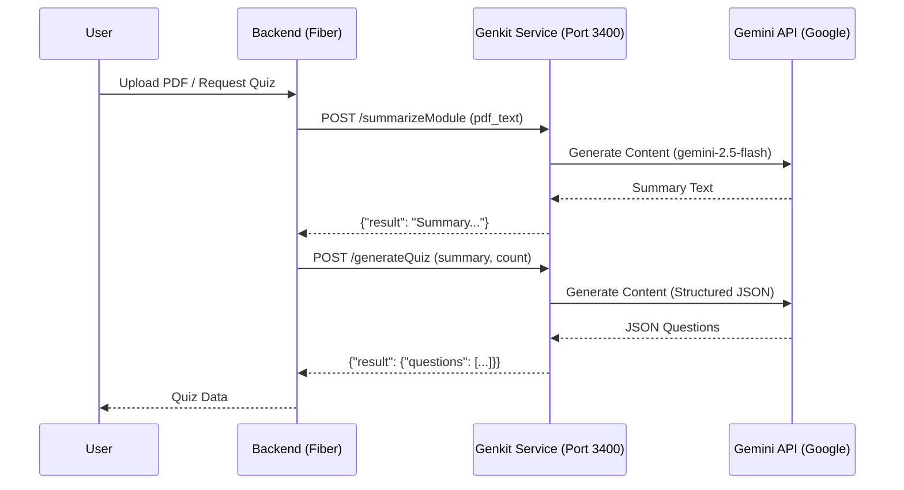

# Genkit AI Service Architecture

Integrasi AI dalam aplikasi ini menggunakan pendekatan *Decoupled Service* untuk fleksibilitas skalabilitas dan kemudahan pengujian.

## Diagram Alur

## Komponen Utama

1. **Backend Client (`pkg/ai/genkit.go`)**:
   - Menggunakan `http.Client` dengan timeout 60 detik.
   - Mengabstraksi panggilan ke Genkit Flow API.
   - Mendukung interface `QuizAI` untuk mempermudah unit testing (mocking).

2. **Genkit Service (`genkit/`)**:
   - **main.go**: Inisialisasi plugin Google AI dan registrasi flow.
   - **flows/summarize.go**: Menangani pemotongan teks (>12k karakter) dan sistem prompt ringkasan.
   - **flows/generate_quiz.go**: Menangani sistem prompt pembuatan soal dan validasi format JSON output.

3. **Prompts (`genkit/prompts/`)**:
   - `summarize.prompt`: Instruksi untuk ringkasan materi UT.
   - `quiz.prompt`: Instruksi untuk format soal pilihan ganda (4 opsi, 1 jawaban).

## Error Handling

- **Genkit Side**: Validasi input (pdf_text tidak kosong, num_questions > 0), validasi JSON parsing dari AI output.
- **Backend Side**: Penanganan timeout, status code non-200, dan pemetaan error (Module Not Found, dsb).
